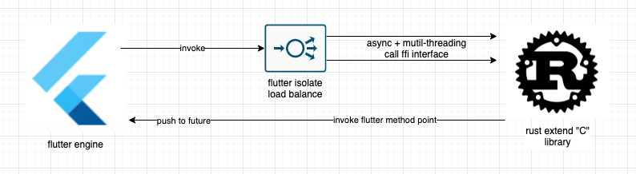

bilibili
==========
bilibili桌面

## 软件截图

#### URL解析器 & 下载器

## 技术实现

#### 架构

展示层使用了Flutter, 渲染性能可以和原生GUI媲美, 逻辑和数据层使用了rust, 效率和C语言相近。

Flutter调用FFI底层方法时会产生阻塞, 所以使用isolate负载均衡器, 使用隔离调用。

Rust调用flutter, 要使用项目初始化时flutter暴露给底层的method指针, method会将event放入future队列, 避免渲染异常。

